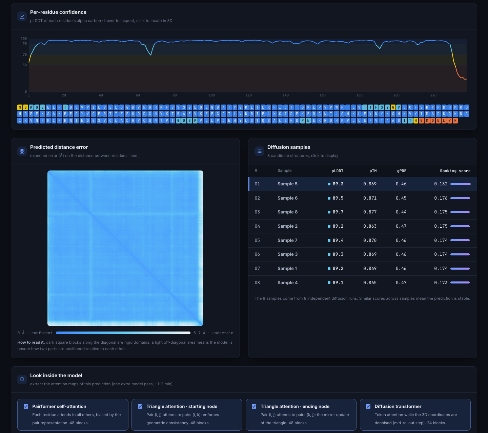
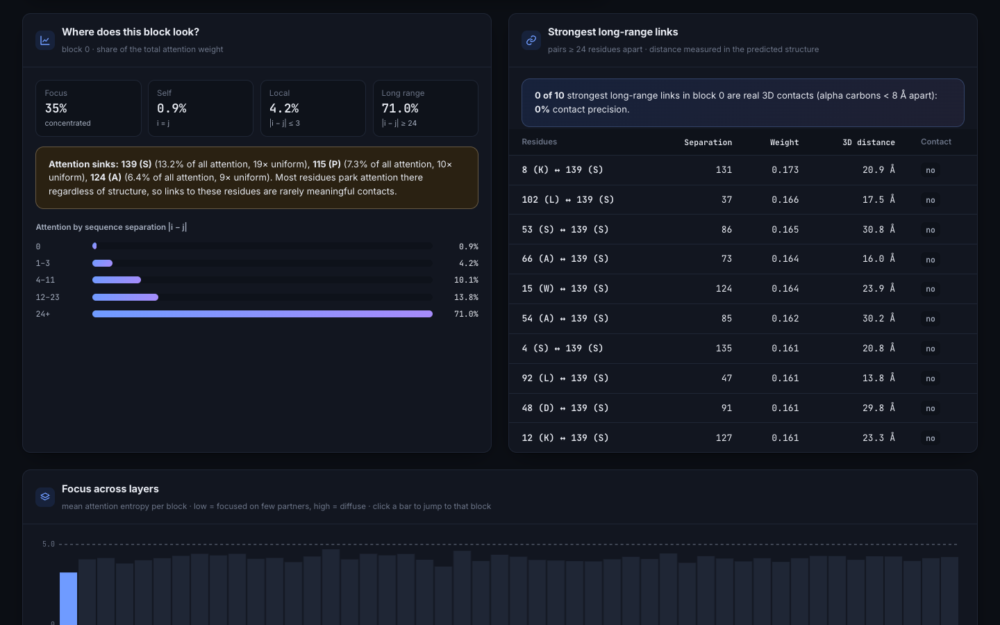
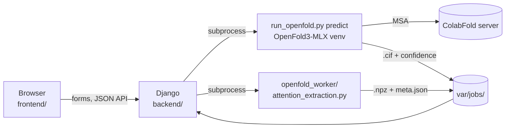

# OpenFold Studio

**A local web app to predict protein 3D structures with [OpenFold3-MLX](https://github.com/latent-spacecraft/openfold-3-mlx) on Apple Silicon, understand how reliable each prediction is, and look inside the model through its attention maps.**


Paste an amino-acid sequence and OpenFold3-MLX runs on your Mac. The app then shows the predicted structure, explains how confident the model is residue by residue, and lets you open the network to see which residues it links together, layer by layer, and whether those links correspond to real contacts in 3D.

## Features

### Prediction
- **One-click prediction** from a sequence, with example proteins and a live analysis of the input (length, mass, net charge, composition).
- **Live progress** through the pipeline (alignment → inference → results).
- **3D viewer** (3Dmol.js) coloured by confidence, in cartoon, stick or sphere mode.

### Confidence analysis
- **Verdict** in plain English combining local (pLDDT) and global (pTM) confidence.
- **Key scores**: mean pLDDT, pTM, gPDE, predicted disorder, steric clashes.
- **Per-residue pLDDT chart** and **sequence strip** coloured by confidence band; click a residue to locate it in 3D.
- **Automatic detection of low-confidence regions** (e.g. flexible termini).
- **Predicted distance error (PDE) map**, to spot rigid domains and uncertain relative placements.
- **Comparison of the 8 diffusion samples** to judge the stability of the prediction.

### Attention explorer
Extracts the attention weights of 4 layer families: Pairformer self-attention (48 blocks), triangle attention starting and ending node (48 blocks each), and the diffusion transformer (24 blocks). For every block:
- **Residue × residue map** and **3D links** from the selected residue to its strongest partners.
- **Where attention goes**: focus (1 − normalised entropy), self, local (|i − j| ≤ 3) and long-range (|i − j| ≥ 24) shares, and a profile by sequence separation.
- **Strongest long-range links with their real 3D distance**, and the **contact precision**: the share of those links that are actual contacts (Cα < 8 Å).
- **Attention sink detection**: residues that receive a disproportionate share of all attention whatever the query.
- **Focus across layers**: entropy of each block, to find the sharpest layers.
- **3D cube view** of triangle attention (i, j, k).

A **"How the model works"** page explains the OpenFold3 architecture, with formulas, and shows where each attention map comes from.

## Screenshots

| Home | Prediction |
|---|---|
|  |  |

| Confidence analysis | Attention insights |
|---|---|
|  |  |


## How it works



1. The **frontend** (Django templates + JavaScript modules) submits the sequence and polls the JSON API for progress.
2. The **backend** validates the sequence, creates the job and runs OpenFold3-MLX **as a subprocess** in its own Python environment, parsing its console output to report progress.
3. **OpenFold3-MLX** fetches a multiple sequence alignment (MSA) from the ColabFold server, predicts 8 candidate structures and writes the `.cif` files and confidence scores to `var/jobs/<id>/`.
4. For the explorer, the **attention worker** runs one more model pass while intercepting the attention function shared by all layers, and saves the weights (averaged over heads) of each layer family.

The code is organised in layers (views → services → models / OpenFold adapter / pure domain logic). Every module is explained in **[docs/ARCHITECTURE.md](docs/ARCHITECTURE.md)**.

## Repository layout

```text
.
├── backend/                  # Django
│   ├── config/               #   settings and root URLs
│   └── predictor/            #   the app: domain/, services/, openfold/, views/, tests/
├── frontend/
│   ├── templates/            # HTML pages (base + partials + one file per page)
│   └── static/               # css/ (tokens, base, components, pages), js/ (ES modules), vendor/
├── openfold_worker/          # script run with OpenFold's Python (attention extraction)
├── patches/                  # patches applied to OpenFold3-MLX
├── scripts/setup_openfold.sh # installs OpenFold3-MLX at a pinned version
├── docs/                     # ARCHITECTURE.md, RESEARCH.md, screenshots
├── Makefile                  # common commands (make help)
├── var/                      # (git-ignored) SQLite database + job results
└── openfold-3-mlx/           # (git-ignored) external dependency
```

## Installation

**Requirements:** a Mac with Apple Silicon (M1 to M4), Python 3.10+, 16 GB of RAM recommended, and an internet connection (for the ColabFold MSA server).

```bash
git clone https://github.com/Felix-Bos/openfold-studio.git
cd openfold-studio

make openfold   # clones and installs OpenFold3-MLX in its own .venv
make install    # creates .venv and installs the web app
make run        # creates the database and starts http://127.0.0.1:8000
```

OpenFold3-MLX downloads the model weights on the first prediction.

Paths can be configured through environment variables (see [.env.example](.env.example)), for example to reuse an existing OpenFold3-MLX installation:

```bash
export OPENFOLD_PROJECT_DIR=/path/to/openfold-3-mlx
```

## Development

```bash
make test    # the test suite, no OpenFold needed (fake outputs are generated)
make lint    # ruff
```

GitHub Actions runs the linter and the tests on every push.

## Research notes

[docs/RESEARCH.md](docs/RESEARCH.md) is an exploratory study of OpenFold3-MLX attention maps: entropy per layer family, local vs long-range attention, strongest links, and the limits of the approach.

> A strong attention weight means the model combines information from two residues in a given layer, **not** that they are in physical contact. The explorer shows the 3D distance of each link for exactly this reason.

## Credits

- [OpenFold3-MLX](https://github.com/latent-spacecraft/openfold-3-mlx) (Geoffrey Taghon), an MLX port of [OpenFold3](https://github.com/aqlaboratory/openfold-3) (AlQuraishi Laboratory), Apache 2.0 licence. This repository does not redistribute it: `scripts/setup_openfold.sh` clones it at commit `eeac37eb`.
- [3Dmol.js](https://3dmol.csb.pitt.edu/) for molecular visualisation, [KaTeX](https://katex.org/) for formulas, [Inter](https://rsms.me/inter/) and [JetBrains Mono](https://www.jetbrains.com/lp/mono/) fonts.
- Confidence bands and colours follow the [AlphaFold Protein Structure Database](https://alphafold.ebi.ac.uk/) convention.
