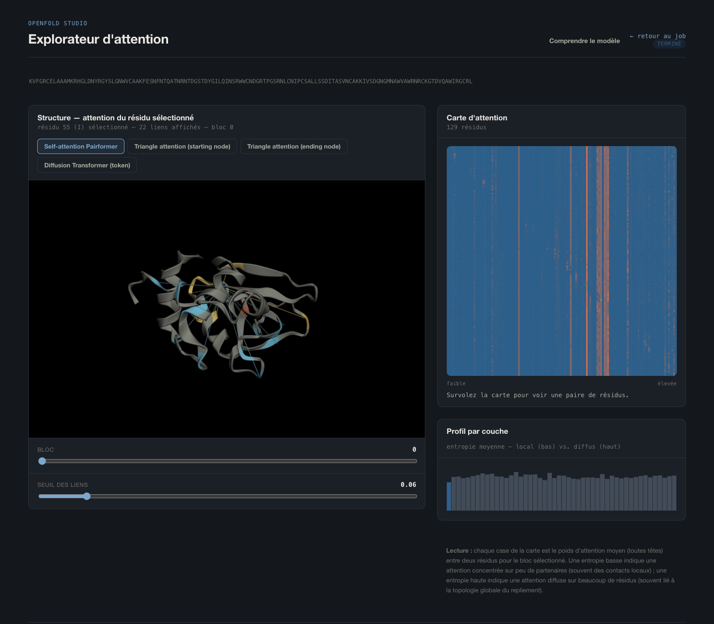
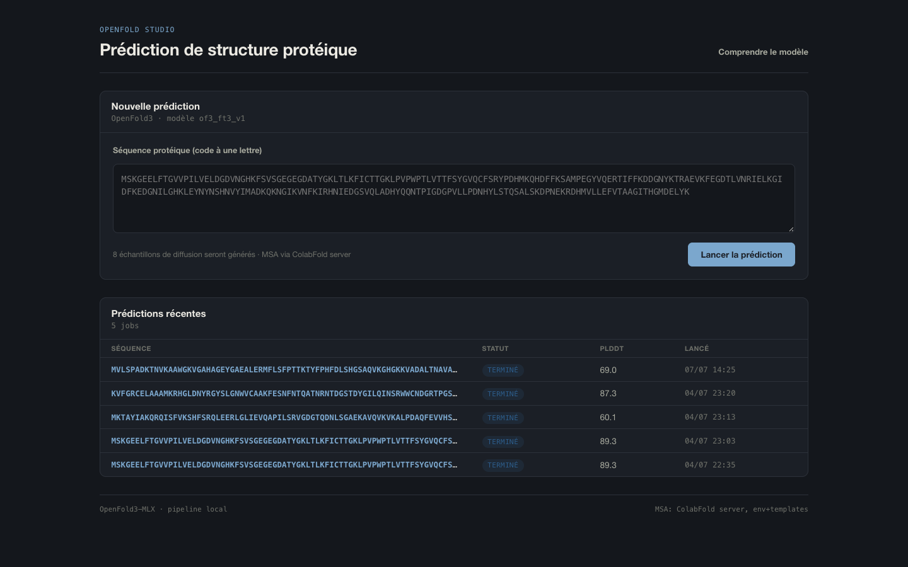
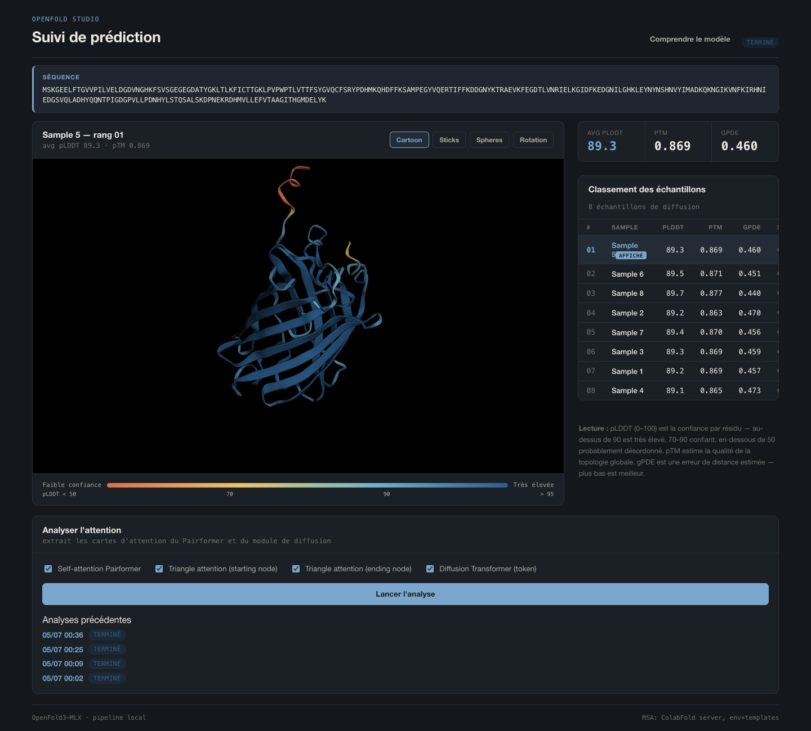
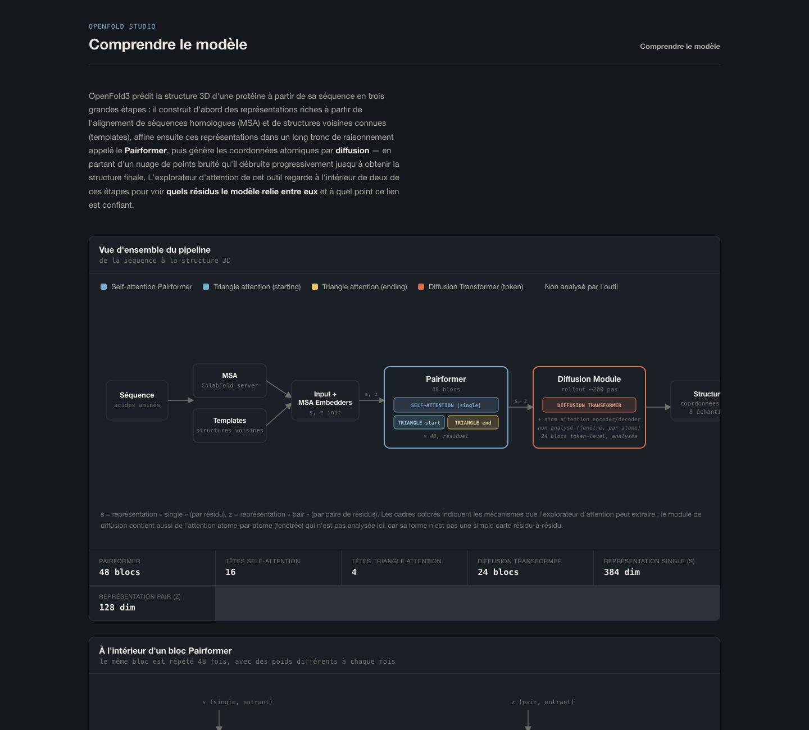
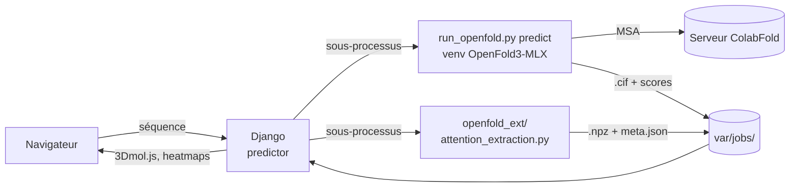

# OpenFold Studio

**Interface web locale pour prédire la structure 3D de protéines avec [OpenFold3-MLX](https://github.com/latent-spacecraft/openfold-3-mlx) sur Mac Apple Silicon, et explorer ce que le modèle « regarde » via ses matrices d'attention.**



On colle une séquence d'acides aminés, OpenFold3-MLX tourne en local, et l'interface affiche la structure prédite, les scores de confiance, puis permet d'ouvrir le modèle pour voir quels résidus il relie entre eux, couche par couche.

## Fonctionnalités

- **Prédiction en un clic** : saisie d'une séquence, lancement d'OpenFold3-MLX en arrière-plan, suivi en direct (MSA, inférence, progression, temps restant).
- **Visualisation 3D** de la structure (3Dmol.js), colorée par confiance pLDDT, en mode cartoon, sticks ou sphères.
- **Classement des 8 échantillons de diffusion** par score (pLDDT, pTM, gPDE).
- **Explorateur d'attention** : extraction des poids d'attention internes du modèle pour 4 familles de couches :
  - self-attention du Pairformer (48 blocs) ;
  - triangle attention, nœud de départ et nœud d'arrivée ;
  - attention token du Diffusion Transformer (24 blocs).
- **Heatmap résidu × résidu** par bloc, **liens 3D** entre le résidu sélectionné et ses partenaires les plus forts, **profil d'entropie** par couche (attention locale vs diffuse).
- **Page « Comprendre le modèle »** qui explique l'architecture d'OpenFold3 et situe chaque carte d'attention dans le pipeline.

## Aperçu

| Nouvelle prédiction | Résultat d'une prédiction |
|---|---|
|  |  |

| Explorateur d'attention | Comprendre le modèle |
|---|---|
|  |  |

## Comment ça marche



Le Studio et OpenFold3-MLX tournent dans **deux environnements Python séparés** : Django n'importe jamais OpenFold, il le lance en sous-processus avec l'interpréteur du `.venv` d'OpenFold et lit les fichiers produits.

L'extraction d'attention (`openfold_ext/attention_extraction.py`) remplace temporairement la fonction d'attention partagée par toutes les couches du modèle pour récupérer les poids après softmax, moyennés sur les têtes et enregistrés en `float16`.

## Structure du dépôt

```text
.
├── manage.py
├── openfold_studio/        # Configuration Django (settings, urls)
├── predictor/              # Application : jobs, runners, vues, templates, JS/CSS
├── openfold_ext/           # Scripts exécutés avec le Python d'OpenFold (extraction d'attention)
├── patches/                # Correctifs appliqués au dépôt OpenFold3-MLX
├── scripts/
│   └── setup_openfold.sh   # Clone OpenFold3-MLX à une version figée + applique les patches
├── docs/
│   ├── RESEARCH.md         # Étude exploratoire des matrices d'attention
│   └── images/
├── var/                    # (ignoré par git) base SQLite + résultats des jobs
└── openfold-3-mlx/         # (ignoré par git) dépendance externe clonée
```

## Installation

**Prérequis** : Mac Apple Silicon (M1 à M4), Python 3.10+, 16 Go de RAM recommandés, connexion internet (MSA via le serveur ColabFold).

```bash
git clone https://github.com/<ton-compte>/openfold-studio.git
cd openfold-studio

# 1. OpenFold3-MLX (dépôt externe, dans son propre .venv)
./scripts/setup_openfold.sh

# 2. Interface web
python3 -m venv .venv
source .venv/bin/activate
pip install -r requirements.txt
python manage.py migrate
python manage.py runserver
```

Puis ouvrir <http://127.0.0.1:8000>. Les poids du modèle sont téléchargés par OpenFold3-MLX lors de la première prédiction.

Les chemins sont configurables par variables d'environnement (voir [.env.example](.env.example)), par exemple pour pointer vers une installation d'OpenFold3-MLX existante :

```bash
export OPENFOLD_PROJECT_DIR=/chemin/vers/openfold-3-mlx
```

## Utilisation

1. Coller une séquence protéique (code à une lettre) et lancer la prédiction.
2. Suivre la progression, puis explorer la structure et le classement des échantillons.
3. Dans « Analyser l'attention », choisir les familles de couches et lancer l'extraction.
4. Dans l'explorateur : changer de famille et de bloc, cliquer sur un résidu, ajuster le seuil des liens.

> Une attention forte signifie que le modèle combine l'information de deux résidus dans une couche donnée, **pas** qu'ils sont en contact physique. À lire avec la structure, les scores de confiance et des connaissances biologiques.

## Étude

[docs/RESEARCH.md](docs/RESEARCH.md) présente une première analyse des cartes d'attention sur deux protéines (GFP, 238 résidus, et lysozyme, 129 résidus) : entropie par famille de couches, part d'attention locale et longue distance, liens les plus forts, et limites de l'approche.

## Crédits

- [OpenFold3-MLX](https://github.com/latent-spacecraft/openfold-3-mlx) (Geoffrey Taghon), portage MLX d'[OpenFold3](https://github.com/aqlaboratory/openfold-3) (AlQuraishi Laboratory), sous licence Apache 2.0. Ce dépôt ne le redistribue pas : il est cloné par `scripts/setup_openfold.sh` à la version `eeac37eb`.
- [3Dmol.js](https://3dmol.csb.pitt.edu/) pour la visualisation moléculaire, [KaTeX](https://katex.org/) pour les formules.
