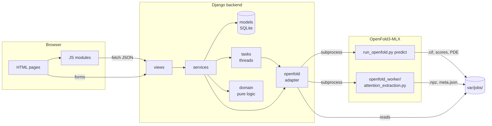

# OpenFold Studio architecture

This document explains how the code is organised, what each part does and why it is split this way. It is written for anyone who wants to read, change or extend the project.

## Overview

OpenFold Studio runs **three programs**:

| Program | Language | Environment | Role |
|---|---|---|---|
| Backend | Python / Django | `.venv` at the repository root | Serves the pages and the JSON API, starts computations, stores jobs, computes insights |
| Frontend | HTML, CSS, JS (ES modules) | the browser | Forms, 3D structure, charts, attention maps |
| OpenFold | Python / PyTorch / MLX | `openfold-3-mlx/.venv` | Predicts the structure and extracts attention |

The backend **never imports OpenFold**: it starts it as a subprocess with OpenFold's own Python interpreter, reads its console output to follow progress, then reads the files it writes. The two environments stay independent (PyTorch, NumPy versions, etc.).



## Directory tree

```text
.
├── backend/                       Django application
│   ├── manage.py
│   ├── config/                    Settings, root URLs, WSGI/ASGI
│   └── predictor/                 The business app
│       ├── domain/                Pure logic (no Django, no files)
│       │   ├── sequence.py        Sequence validation, example proteins
│       │   ├── structure.py       mmCIF → residues (pLDDT, Cα), distance matrix
│       │   ├── confidence.py      pLDDT bands, low-confidence regions, verdict
│       │   └── attention.py       Layer families, block metrics, links, sinks
│       ├── openfold/              Adapter to OpenFold3-MLX
│       │   ├── workspace.py       On-disk layout of a job
│       │   ├── commands.py        Command lines, query JSON, environment
│       │   ├── process.py         Starting the process and streaming its output
│       │   ├── log_parser.py      Console output → progress events and errors
│       │   └── results.py         Reading scores, structures, PDE, tensors
│       ├── services/              Use cases (business rules)
│       │   ├── compute.py         One GPU computation at a time
│       │   ├── predictions.py     Submit, follow, read and interpret a prediction
│       │   └── attention.py       Start an extraction, serve maps and insights
│       ├── views/
│       │   ├── pages.py           HTML pages
│       │   └── api.py             JSON endpoints
│       ├── templatetags/studio.py Template filters (duration, percent)
│       ├── models.py              PredictionJob, AttentionRun
│       ├── forms.py               Form validation
│       ├── tasks.py               Background execution
│       ├── errors.py              Business errors
│       ├── urls.py                Page routes  (namespace "predictor")
│       ├── api_urls.py            API routes   (namespace "api", under /api/)
│       ├── migrations/
│       └── tests/
├── frontend/
│   ├── templates/
│   │   ├── base.html              Shared shell (top bar, messages, footer)
│   │   ├── partials/              Reused fragments (status pill, pLDDT, icons…)
│   │   └── predictor/             One file per page
│   └── static/
│       ├── css/                   tokens → base → components → pages/
│       ├── js/
│       │   ├── lib/               Shared utilities and components
│       │   ├── home/              Home page logic
│       │   ├── job/               Job page components
│       │   ├── attention/         Attention explorer components
│       │   ├── architecture/      Content of the "How the model works" page
│       │   └── pages/             One entry point per page
│       ├── img/                   Favicon
│       └── vendor/                3Dmol.js, KaTeX (third-party libraries)
├── openfold_worker/               Scripts run with OpenFold's Python
├── patches/                       Patches applied to OpenFold3-MLX
├── scripts/setup_openfold.sh      OpenFold3-MLX installation
├── var/                           Local data (git-ignored)
└── openfold-3-mlx/                External dependency (git-ignored)
```

## Backend: a layered architecture

Each layer only depends on the layers **below** it:

```text
views        HTTP: read the request, call a service, build the response
  ↓
services     Business rules: "one computation at a time", "the job must be completed"
  ↓
tasks        Run long computations outside the HTTP request
  ↓
models       Persistent state and state transitions
openfold     Everything about OpenFold (commands, logs, files)
domain       Pure functions, no Django and no files
```

Concrete consequences:

- **Views are thin.** They contain no business rule. `pages.index` validates the form, calls `submit_prediction` and redirects.
- **Services know nothing about HTTP.** They raise business errors (`predictor/errors.py`); views turn them into flash messages (pages) or JSON 400/404 responses (API, through the `json_endpoint` decorator).
- **The domain is trivial to test.** `parse_sequence`, `band_fractions`, `block_statistics` or `attention_sinks` take and return plain Python / NumPy values.
- **OpenFold is isolated.** Replacing it with another engine would only touch the `openfold/` package.

### `domain/`: pure logic

- **`sequence.py`** cleans the pasted sequence (spaces, line breaks, lower case) and checks it only contains one-letter amino-acid codes; the error message lists the rejected characters. It also holds the example proteins offered on the home page.
- **`structure.py`** reads the `_atom_site` table of an mmCIF file and keeps one `Residue` per alpha carbon: its number, name, pLDDT (OpenFold writes it in the B-factor column) and coordinates. `ca_distance_matrix` gives the N × N distances used to check whether attention links are real contacts.
- **`confidence.py`** interprets pLDDT with the AlphaFold database bands (> 90 very high, 70–90 confident, 50–70 low, < 50 very low), finds runs of ≥ 3 residues below 70, writes the plain-English verdict, and block-averages large matrices for display.
- **`attention.py`** defines the 4 analysable **layer families** (Pairformer self-attention, triangle attention start/end, diffusion transformer); this is the single source of truth used by forms, templates and the API. It also computes, for one [N, N] block:
  - `block_statistics`: normalised entropy, self / local / long-range shares, mass per sequence-separation bin;
  - `top_long_range_links`: strongest pairs ≥ 24 residues apart, with their 3D distance and whether they are contacts (< 8 Å);
  - `contact_precision`: share of those links that are contacts;
  - `attention_sinks`: residues receiving more than 5× their uniform share of all attention;
  - `family_summary`: the same statistics aggregated over all blocks of a family;
  - `sparse_cube_points`: turns a dense N × N × N cube (2 million values for 129 residues) into the list of points above a threshold, so the browser only receives what it will draw.

### `openfold/`: the adapter

- **`workspace.py`** is the **single source of truth for paths**. A job with id `abc` lives in `var/jobs/abc/`; its sample 3 structure is `var/jobs/abc/query_abc/seed_42/query_abc_seed_42_sample_3_model.cif`. Paths are computed, **never stored in the database**, so the project can be moved without breaking existing jobs.
- **`commands.py`** builds the JSON query given to OpenFold and the two command lines (prediction and attention extraction). It also puts the OpenFold checkout on `PYTHONPATH`, so `import openfold3` works even if its editable install points to an old location.
- **`process.py`** starts the subprocess and reads its output **one character at a time**: tqdm progress bars rewrite the same line with `\r`, so line-by-line reading would only see the final state. Reading happens on a separate thread, because PyTorch Lightning workers inherit the output pipe and may keep it open after the main process exits; the generator also watches `process.poll()` so it never waits forever.
- **`log_parser.py`** turns a log line into a `ProgressEvent` (step, MSA or inference phase, percent, elapsed and remaining time). `ErrorCollector` keeps every line from the first `Traceback` on, so the UI shows the whole error and not just its header.
- **`results.py`** reads each sample's scores (`SampleScores`: pLDDT, pTM, gPDE, ranking score, disorder, clash), structures, per-residue data (cached by file path and modification time), the PDE matrix, and the attention tensors (`.npz`).

### `models.py`: persistent state

- **`PredictionJob`**: one prediction, going through `pending` → `running_msa` → `running_inference` → `completed` or `failed`.
- **`AttentionRun`**: one attention extraction on a completed job, `pending` → `running` → `completed` or `failed`.

**State transitions are model methods** (`mark_started`, `apply_progress`, `mark_completed`, `mark_failed`), so the rules for moving between statuses live in one place. `objects.active()` returns the rows being computed; `duration` and `length` are derived properties.

### `tasks.py`: background execution

A prediction takes minutes. The view creates the database row, calls `tasks.start_prediction(job_id)` and responds immediately; the computation runs on a thread:

1. write `query.json`;
2. start `run_openfold.py predict`;
3. for each output line: append it to `run.log`, turn it into a progress event and apply it to the job (saved at most once per second so SQLite is not flooded);
4. at the end: read every sample's scores and mark the job `completed`, or keep the error report and mark it `failed`.

Any unexpected exception (missing OpenFold interpreter, etc.) marks the row `failed` instead of leaving it stuck "running".

Threads are enough for a single-user local tool. A multi-user deployment would replace this one module with a real task queue (Celery, RQ…) without touching views or services.

### `services/`: use cases

- **`compute.py`**: `ensure_compute_available()` refuses a new computation while a prediction or an extraction is running; both load the full model into unified memory and two at once would exhaust a Mac.
- **`predictions.py`**: submit a sequence, build the progress snapshot sent to the browser, read structures, compute the **confidence analysis** of a sample (per-residue pLDDT, bands, regions, verdict, scores, downsampled PDE) and the home page statistics. During inference OpenFold only prints a single-step bar (0 % then 100 %), so progress is reported as **indeterminate** rather than a bar stuck at 0 %.
- **`attention.py`**: start an extraction (the job must be completed; no family ticked means "all"), summarise every family, and serve **one block at a time** together with its statistics, links and sinks. A whole family (48 blocks × N × N) would be tens of MB of JSON.

### Views and routes

**HTML pages** (`urls.py`, namespace `predictor`):

| URL | View | Role |
|---|---|---|
| `/` | `index` | Form, statistics and recent jobs (GET), submission (POST) |
| `/jobs/<id>/` | `job_detail` | Progress, structure, confidence analysis, samples |
| `/jobs/<id>/attention/` | `attention_create` | Starts an extraction (POST) |
| `/jobs/<id>/attention/<run>/` | `attention_explorer` | Attention explorer |
| `/architecture/` | `architecture` | How the model works |

**JSON API** (`api_urls.py`, namespace `api`, under `/api/`):

| URL | Response |
|---|---|
| `jobs/<id>/status/` | Status and progress of a prediction |
| `jobs/<id>/samples/<n>/structure/` | mmCIF file of a sample |
| `jobs/<id>/samples/<n>/confidence/` | Per-residue pLDDT, bands, regions, verdict, scores, PDE |
| `jobs/<id>/attention/<run>/status/` | Status of an extraction |
| `jobs/<id>/attention/<run>/families/` | Shape and summary of every extracted family |
| `…/families/<family>/` | `[blocks, N, N]` shape of a family |
| `…/families/<family>/blocks/<b>/` | N × N matrix of a block, its statistics, links and sinks |
| `…/families/<family>/blocks/<b>/cube/?threshold=0.6` | `[i, j, k, weight]` points of the cube (triangle attention) |

## Frontend

### Templates

`base.html` holds the shared shell (sticky top bar with navigation and theme toggle, flash messages, footer) and exposes the blocks `title`, `page_class`, `page_styles`, `content` and `page_scripts`. Each page only adds its own stylesheet and script. Repeated fragments live in `partials/` (status pill, pLDDT value, SVG icons, error box).

**HTML contains no inline JavaScript.** Data reaches the scripts in two ways:

- **URLs** in `data-*` attributes generated by ``: scripts never hard-code a URL;
- **data** (structure, sequence) through `{{ value|json_script:"id" }}`, read with `readJsonScript("id")`, which is Django's safe way to embed data.

### CSS in layers

| File | Content |
|---|---|
| `tokens.css` | Colours, fonts, spacing, radii, shadows; light and dark themes |
| `base.css` | Reset, top bar, page container, page header, footer |
| `components.css` | Shared components: panel, button, segmented control, pill, metric card, callout, table, stacked bar, progress, viewer, chart, form fields |
| `pages/*.css` | What only exists on one page |

The confidence colours follow the AlphaFold database convention and are defined once as CSS variables; canvas and 3D code read them at runtime through `lib/palette.js`, so everything follows the theme.

### JavaScript as ES modules

Each page loads **one entry point** from `js/pages/`, which assembles components:

- **`lib/`**, shared building blocks:
  - `palette.js`: colours read from the CSS tokens, refreshed on theme change;
  - `canvas.js`: Retina-sharp canvases, tooltips, redraw on resize;
  - `matrix-canvas.js`: generic square heatmap with hover and click (PDE and attention maps);
  - `polling.js`, `format.js`, `dom.js`, `theme.js`, `structure-viewer.js`.
- **`home/sequence-analysis.js`**: pure functions computing length, mass, charge and composition of the typed sequence.
- **`job/`**: `SampleViewer` (3D, pLDDT colouring, residue highlighting), `PlddtChart` (per-residue curve), `ConfidenceView` (verdict, cards, bands, regions, sequence strip), `initJobProgress`.
- **`attention/`**: `AttentionApi` (cached API client), `analysis.js` (pure functions: most connected residue, partners above threshold), `AttentionStructureView` (3D links), `CubeView` (3D point cloud with mouse rotation), `EntropyChart` (entropy per block, click to jump), `InsightsView` (metrics, sinks, separation profile, links table).
- **`pages/attention-explorer.js`** holds the state (family, block, residue, thresholds). Every control updates the state, then calls `refresh()` (new block) or `renderLinks()` (same block, new selection), so all views stay in sync.

## The attention worker

`openfold_worker/attention_extraction.py` runs **in OpenFold's environment**. No OpenFold layer returns its attention weights, so the script temporarily replaces the attention function shared by the whole network (`openfold3.core.model.primitives.attention._attention`) with a version that also keeps the post-softmax weights, noting which layer is calling it.

Three details matter for correctness:

- **Chunking.** For larger proteins OpenFold splits triangle attention into chunks, so one layer call produces several `_attention` calls. Captures are grouped per layer invocation and the chunks are concatenated back into the full map.
- **Recycling.** The Pairformer runs 4 times per prediction (recycling), and block 0 is also called during chunk-size tuning. Only the **last** invocation is kept: the one that produced the final structure.
- **Triangle maps.** Triangle attention produces a cube `w[i, j, k]` normalised over k. The saved N × N map is the average over the query index **j**; averaging over k would give a constant 1/N map.

Weights are averaged over heads and saved as one `.npz` per family (float16), plus a `meta.json` with the entropy of each block.

## Configuration

Everything machine-specific is set through environment variables (see `.env.example`), with defaults that work locally: `OPENFOLD_PROJECT_DIR`, `OPENFOLD_PYTHON`, `OPENFOLD_RUNNER_YAML`, `OPENFOLD_JOBS_DIR`, `DJANGO_SECRET_KEY`, `DJANGO_DEBUG`, etc. Computation constants (seed 42, 8 diffusion samples) live in `config/settings.py`.

## Tests

```bash
make test
```

The tests **do not need OpenFold**: they write fake outputs to a temporary directory (`tests/factories.py`), and replace the OpenFold command with a small Python script to test the background pipeline.

| File | What is tested |
|---|---|
| `test_domain.py` | Sequence validation, thresholds, cube sparsification |
| `test_insights.py` | Structure parsing, confidence bands and regions, attention metrics, links, sinks |
| `test_log_parser.py` | Parsing of real OpenFold log lines, error collection |
| `test_services.py` | Business rules: single computation, completed job, ranking, block reading |
| `test_tasks.py` | Full pipeline with a fake OpenFold (success and failure) |
| `test_views.py` | Pages, form, redirects, API and JSON errors |

GitHub Actions (`.github/workflows/tests.yml`) runs the linter and the tests on every push.

## Known limitations

- If the Django server stops during a computation, the job stays marked "running": the thread that followed it is gone.
- The "one computation at a time" check is not atomic. That is fine for a single user; several users would need a lock.
- Attention data is loaded in full from its `.npz` file on every block request.
- The frontend is not unit-tested; its logic is kept in small pure functions (`analysis.js`, `sequence-analysis.js`) to make that easy to add.
